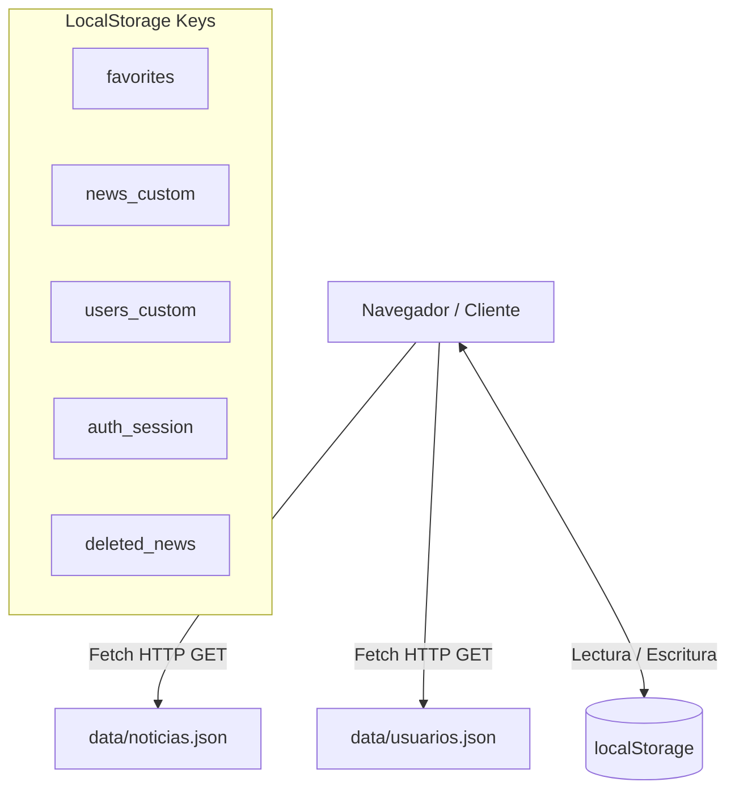

# Portal Web de Noticias — Entrega 2 (Prototipo Funcional)

Un portal web de noticias multipágina interactivo, responsive y modular, desarrollado para la **Entrega 2 (Semana 5)**. Permite explorar noticias, buscar por título, filtrar por categorías, consultar vistas detalladas, administrar favoritos, validar formularios de contacto y gestionar noticias mediante un mini CRUD protegido por autenticación.

---

## 📋 Tabla de Contenidos

1. [Tecnologías Utilizadas](#-tecnologías-utilizadas)
2. [Estructura del Proyecto](#-estructura-del-proyecto)
3. [Componentes y Arquitectura](#-componentes-y-arquitectura)
4. [Flujo de Datos y Protocolos de Comunicación](#-flujo-de-datos-y-protocolos-de-comunicación)
5. [Funcionalidades por Página](#-funcionalidades-por-página)
6. [Instalación y Ejecución](#-instalación-y-ejecución)
7. [Credenciales de Prueba](#-credenciales-de-prueba)
8. [Sistema de Diseño (CSS)](#-sistema-de-diseño-css)

---

## 🛠️ Tecnologías Utilizadas

- **HTML5 Semántico**: Uso estricto de `<header>`, `<nav>`, `<aside>`, `<main>`, `<article>` y `<footer>`.
- **CSS3 Nativo**: Grid Layout, Flexbox y Variables CSS centralizadas. Sin frameworks externos.
- **Vanilla JavaScript (ES6+)**: Programación modular basada en funciones puras, `async/await` y manipulación del DOM.
- **Almacenamiento Local (`localStorage`)**: Persistencia del estado de sesión, noticias personalizadas, eliminadas y lista de favoritos.
- **JSON Semilla**: Datos iniciales de noticias y usuarios consumidos mediante Fetch API.

---

## 📁 Estructura del Proyecto

```text
front_end/
├── index.html              # Home: Hero destacadas, barra de búsqueda y filtro por categoría
├── detalle.html            # Vista detallada de noticia (?id=...) con toggle de favoritos
├── favoritos.html          # Vista de noticias guardadas en el navegador
├── contacto.html           # Formulario de contacto con validaciones inline en tiempo real
├── login.html              # Autenticación (Login / Registro) con manejo de sesión
├── admin.html              # Panel de administración CRUD de noticias (Protegido por Auth Guard)
├── AGENTS.md               # Guía canónica de directrices de desarrollo del proyecto
├── PENDIENTES.md           # Hoja de ruta de funcionalidades pendientes y correcciones
├── css/
│   ├── variables.css       # Tokens de diseño: colores, fuentes, espaciados, z-index
│   ├── layout.css          # Estructura global, sidebar colapsable, header y footer
│   └── components.css      # Tarjetas, botones, badges, modales, formularios y alertas
├── js/
│   ├── storage.js          # Helper centralizado para get/set/remove en localStorage
│   ├── news-service.js     # Servicio de datos (Fetch JSON + merge con noticias custom)
│   ├── news-renderer.js    # Motor de renderizado dinámico en el DOM
│   ├── favorites.js        # Lógica de gestión e interacción con favoritos
│   ├── validations.js      # Motor de validación de formularios y feedback visual
│   └── app.js              # Inicialización global (sidebar toggle, auth guard, active link)
├── data/
│   ├── noticias.json       # Semilla estática de noticias (14 artículos iniciales)
│   └── usuarios.json       # Semilla estática de usuarios registrados
└── assets/
    └── img/                # Recursos gráficos y guía README de imágenes
```

---

## 🧩 Componentes y Arquitectura

El proyecto adopta un patrón **Layered Vanilla Architecture** dividiendo las responsabilidades en capas claras:

1. **Capa de Persistencia (`storage.js`)**: Abstrae las lecturas y escrituras en `localStorage` con serialización JSON segura.
2. **Capa de Servicios de Datos (`news-service.js`)**: Fusiona la fuente de datos estática (`noticias.json`) con las mutaciones del usuario guardadas en `localStorage` (`news_custom` y `deleted_news`).
3. **Capa de Presentación y Renderizado (`news-renderer.js`)**: Genera componentes HTML limpios y dinámicos para cards, héroes, vistas de detalle y estados vacíos.
4. **Capa de UI/Global (`app.js`)**: Gestiona la barra lateral colapsable, la navegación activa y la verificación de sesión (`Auth Guard`).

---

## 🔄 Flujo de Datos y Protocolos de Comunicación



### Protocolo de Integración de Noticias (`news-service.js`):
1. Se consulta `data/noticias.json` mediante la Fetch API.
2. Se filtran las noticias cuyos IDs figuren en la lista `deleted_news` de `localStorage`.
3. Se prependan las noticias creadas localmente desde el panel de administración (`news_custom`).
4. El array unificado es retornado para ser procesado por los filtros de búsqueda o categoría.

---

## ⚙️ Funcionalidades por Página

### 1. Inicio (`index.html`)
- **Sección Hero**: Destaca la noticia principal marcada con `destacada: true`.
- **Barra de Búsqueda**: Filtrado interactivo en tiempo real por palabra clave en título o contenido.
- **Filtro por Categoría**: Tabs de navegación rápida (*Todas, Deportes, Finanzas, Educación, Tecnología, Política, Cultura, Salud*).

### 2. Detalle de Noticia (`detalle.html`)
- Carga dinámica del artículo según el parámetro URL `?id=...`.
- Muestra portada, metadatos (autor, fecha, categoría, tiempo de lectura) y cuerpo del artículo.
- Botón dinámico para agregar/quitar de favoritos.

### 3. Favoritos (`favoritos.html`)
- Muestra únicamente los artículos guardados por el usuario.
- Permite remover elementos individualmente o vaciar la lista por completo.

### 4. Contacto (`contacto.html`)
- Formulario interactivo con campos: *Nombre, Email, Asunto y Mensaje*.
- Validación en tiempo real con mensajes de error visuales.

### 5. Login / Registro (`login.html`)
- Sistema de autenticación en cliente.
- Valida credenciales contra `usuarios.json` y `users_custom` en `localStorage`.
- Permite registrar nuevos usuarios con almacenamiento persistente.

### 6. Panel Admin (`admin.html`)
- **Auth Guard**: Redirige a `login.html` si no existe una sesión activa.
- **CRUD completo de noticias**:
  - **Crear**: Modal con formulario validado. Persiste en `news_custom`.
  - **Editar**: Modal pre-diligenciado para actualizar artículos existentes.
  - **Eliminar**: Diálogo de confirmación. Oculta artículos del seed o borra de `news_custom`.

---

## 🚀 Instalación y Ejecución

Debido al uso de `fetch()` para consumir los archivos JSON locales, el proyecto debe ejecutarse mediante un **servidor HTTP local**.

### Método 1: Python (Recomendado)
Abre tu terminal en el directorio raíz del proyecto:
```bash
cd /ruta/al/proyecto/front_end
python3 -m http.server 8000
```
Navega a: **`http://localhost:8000`**

### Método 2: Node.js (`npx`)
```bash
npx serve .
```

### Método 3: VS Code / Cursor
Instala la extensión **Live Server**, abre `index.html`, haz clic derecho y selecciona **"Open with Live Server"**.

---

## 🔑 Credenciales de Prueba

| Rol | Email | Contraseña |
|---|---|---|
| **Administrador** | `admin@portal.com` | `admin123` |
| **Usuario Demo** | `demo@portal.com` | `demo123` |

---

## 🎨 Sistema de Diseño (CSS)

Todas las variables globales de diseño están definidas en [`css/variables.css`](file:///Users/vmeleg/front_end/css/variables.css):

```css
:root {
  --color-primary:       #1a73e8; /* Azul principal */
  --color-primary-dark:  #0d47a1;
  --color-primary-light: #e8f0fe;
  --color-surface:       #ffffff;
  --color-bg:            #f0f4f8;
  --sidebar-width:       260px;
}
```
